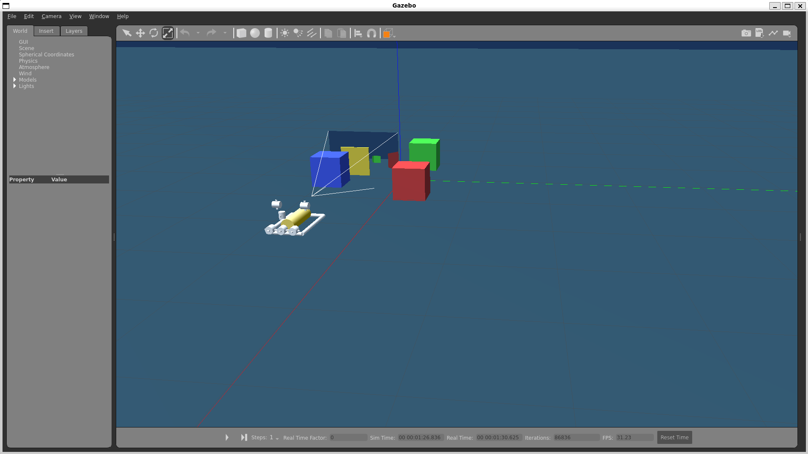
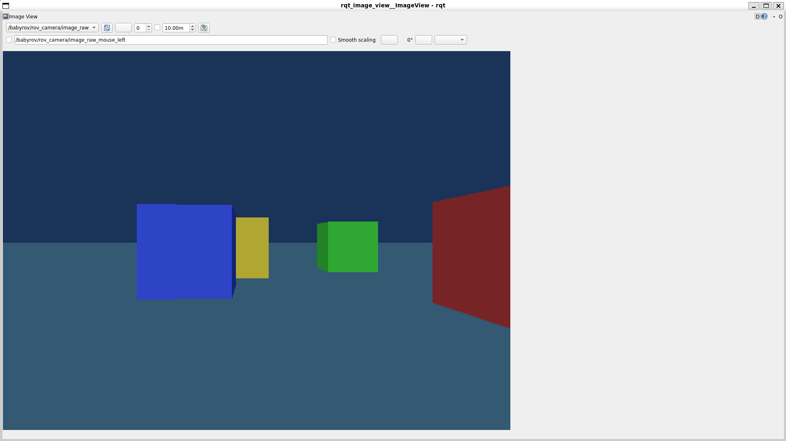

# Underwater ROV Simulation (ROS2 + Gazebo)

This project demonstrates a **ROS2-based underwater ROV simulation** using Gazebo.

The simulation models a low-cost inspection ROV with:

- frame structure
- thrusters
- onboard camera
- buoyancy approximation
- underwater environment

The system can be controlled via ROS velocity commands and provides a simulated camera feed.

---

## Simulation Overview

### Gazebo Environment



The Gazebo world includes:

- underwater lighting
- seabed terrain
- inspection objects
- ROV model

---

### Onboard Camera Feed



The ROV includes a forward camera publishing ROS topics.

Topic:


/babyrov/rov_camera/image_raw


---

# System Architecture

The simulation uses:

- **ROS2 Humble**
- **Gazebo Classic**
- **gazebo_ros plugins**

Key components:

| Component | Purpose |
|--------|--------|
| model.sdf | ROV physical model |
| ocean.world | underwater environment |
| planar_move plugin | simplified thruster control |
| camera plugin | simulated camera sensor |

---

# Repository Structure

```
rov_underwater_sim
│
├── rov_sim
│ ├── models
│ │ └── babyrov
│ │
│ ├── worlds
│ │ └── ocean.world
│ │
│ └── launch
│ └── rov_demo.launch.py
│
├── images
│
└── README.md
```

---

# Installation

### Requirements

- Ubuntu 22.04
- ROS2 Humble
- Gazebo

Install dependencies:

```
sudo apt install ros-humble-gazebo-ros-pkgs
sudo apt install ros-humble-gazebo-plugins
sudo apt install ros-humble-rqt-image-view
```

---

# Running the Simulation

```
cd ~/rov_ws
source install/setup.bash
ros2 launch rov_sim rov_demo.launch.py
```

This launches:

- Gazebo world
- ROV model
- camera viewer

---

# Viewing Camera Feed

```
ros2 run rqt_image_view rqt_image_view
```

Select:

```
/babyrov/rov_camera/image_raw
```

---

# Features

- Underwater environment
- Pipe-frame ROV structure
- Simulated thrusters
- ROS2 camera sensor
- Inspection objects in environment

---

# Future Improvements

Possible extensions:

- 6DOF underwater dynamics
- real thruster physics
- underwater current simulation
- SLAM or visual navigation

---

# License

MIT License
